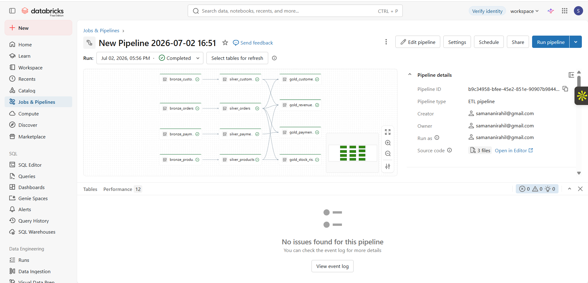
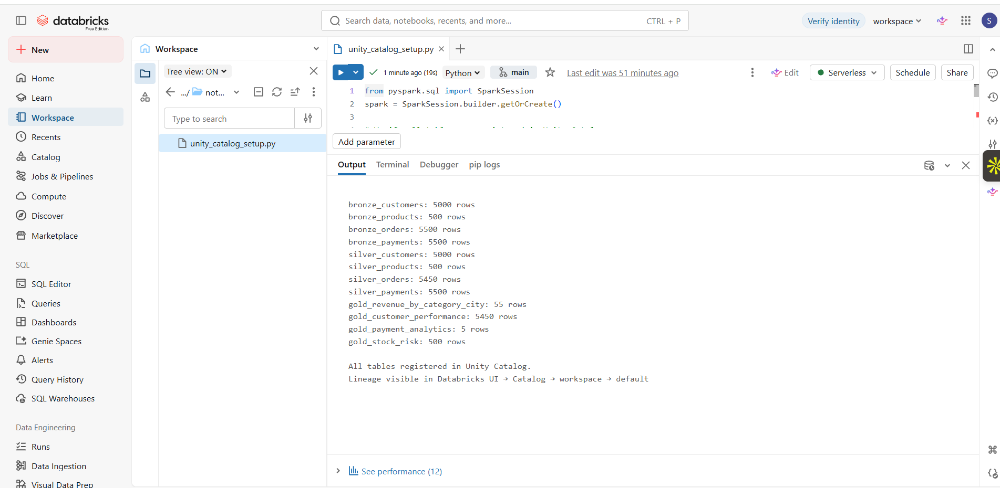
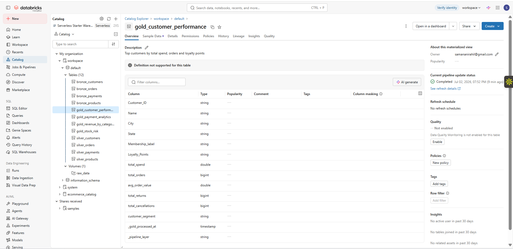
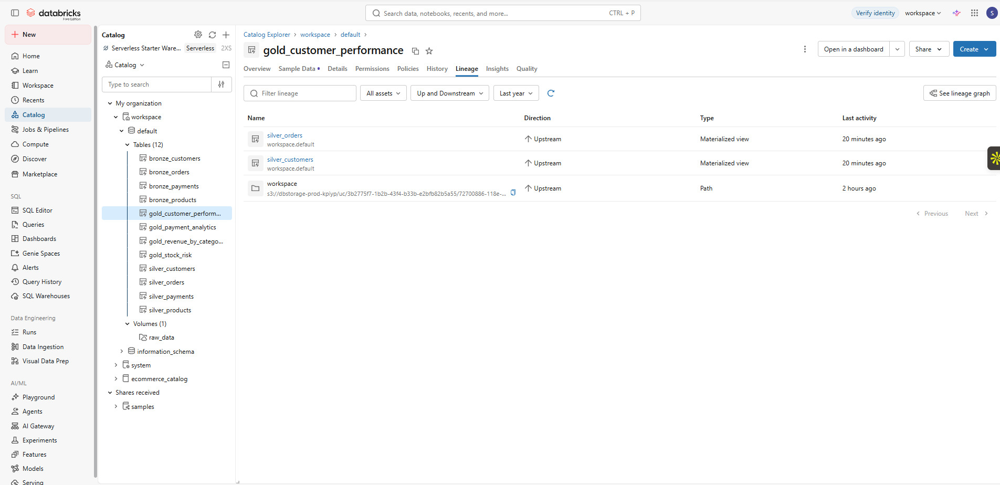
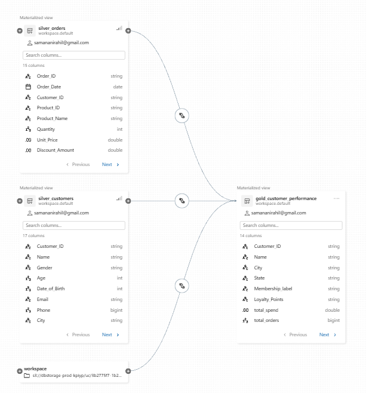
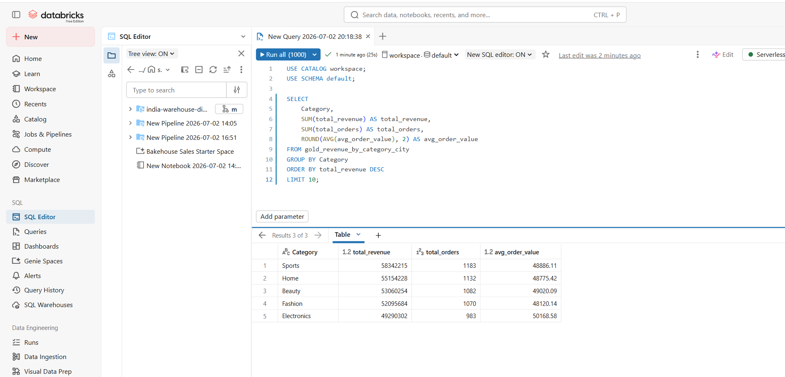
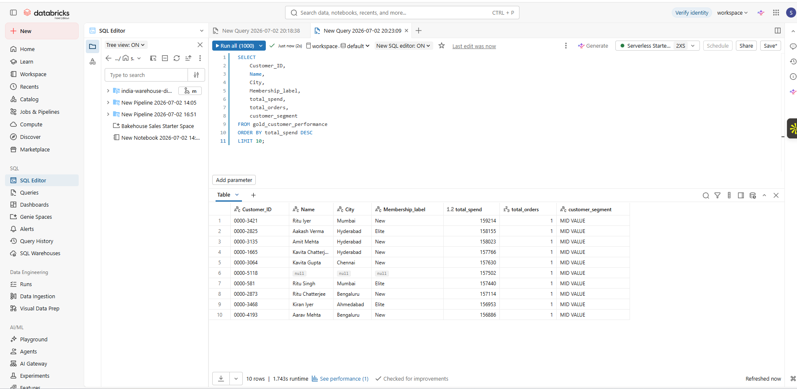
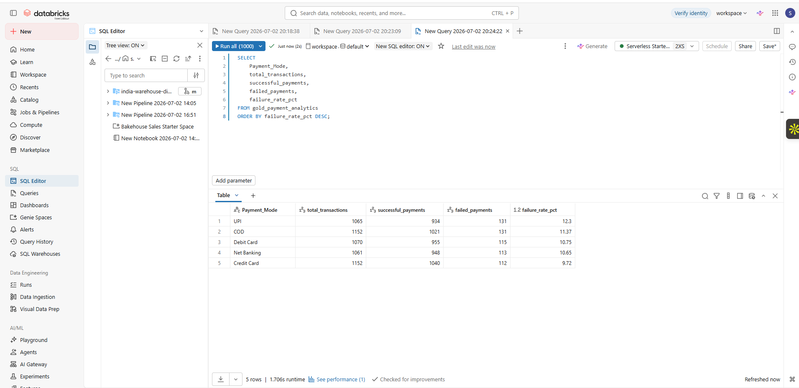

# Indian E-Commerce Analytics Pipeline

An end-to-end data engineering pipeline built on Databricks that ingests real Indian e-commerce data across customers, orders, products and payments, transforms it through a Bronze-Silver-Gold Delta Lake architecture using Delta Live Tables, and computes business insights including revenue analytics, customer segmentation, payment failure rates and stock-out risk — all governed through Unity Catalog.

---

# 📑 Table of Contents

- [Overview](#overview)
- [Architecture](#architecture)
- [Tech Stack](#tech-stack)
- [Project Structure](#project-structure)
- [Data Flow](#data-flow)
- [Data Quality](#data-quality)
- [Gold Layer Analytics](#gold-layer-analytics)
- [Unity Catalog Lineage](#unity-catalog-lineage)
- [Results](#results)

---

# 📖 Overview

This project processes **5000+ customers**, **5500+ orders**, **500 products**, and **5500 payment transactions** across **10 major Indian cities**.

The pipeline detects payment failure patterns, flags products at stock-out risk, segments customers by spend, and computes revenue breakdown by category and city — all in a governed, lineage-tracked lakehouse on Databricks.

---

# 🏗️ Architecture


---

# ⚙️ Tech Stack

| Component | Technology |
|:----------|:-----------|
| Platform | Databricks (Free Edition) |
| Storage | Delta Lake, DBFS Unity Catalog Volume |
| Pipeline | Delta Live Tables (DLT) |
| Processing | PySpark |
| Orchestration | Databricks Workflows |
| Governance | Unity Catalog |
| Analytics | Databricks SQL |
| Language | Python |
| Version Control | Git, GitHub |

---

# 📂 Project Structure

```text
india-warehouse-digital-twin/
│
├── dlt_pipeline/
│   ├── bronze_layer.py          # Raw ingestion from DBFS volume into Delta tables
│   ├── silver_layer.py          # Data cleaning, validation, DLT expectations
│   └── gold_layer.py            # Aggregated business metrics
│
├── notebooks/
│   └── unity_catalog_setup.py   # Table verification and lineage check
│
├── sql/
│   └── analytical_queries.sql   # Databricks SQL queries on Gold layer
│
├── workflows/
│   └── databricks_workflow.py   # Databricks Workflow job definition
│
├── requirements.txt
└── README.md
```

---

# 🔄 Data Flow

## 🥉 Bronze Layer

Raw CSV files uploaded to

```text
/Volumes/workspace/default/raw_data/
```

are ingested as-is into Delta tables with audit columns:

- `_ingested_at`
- `_pipeline_layer`

Column names with special characters are renamed at this stage.

---

## 🥈 Silver Layer

DLT expectations enforce data quality before writing.

### Validation Rules

- `@dlt.expect_or_drop` — drops rows with null `Customer_ID`, `Order_ID`, `Product_ID`
- `@dlt.expect_or_drop` — drops rows where `Total_Amount <= 0` or `Selling_Price <= 0`
- Deduplication on primary keys
- Currency columns (`Transaction_Fee`, `Refund_Amount`) cleaned of `₹` symbols
- Stock risk flag added per product

---

## 🥇 Gold Layer

Four aggregated tables are computed from Silver.

| Gold Table | Description |
|:-----------|:------------|
| gold_revenue_by_category_city | Total revenue, orders and average order value per category and city |
| gold_customer_performance | Total spend, orders, returns and HIGH/MID/LOW VALUE customer segmentation |
| gold_payment_analytics | Success/failure rates and refund totals per payment mode |
| gold_stock_risk | Days of stock remaining and CRITICAL/LOW/HEALTHY stock status |

---

# ✅ Data Quality

| Quality Check | Layer | Action |
|:--------------|:-----:|:-------|
| Null Customer_ID | Silver | Drop row |
| Null Order_ID | Silver | Drop row |
| Null Product_ID | Silver | Drop row |
| Total_Amount <= 0 | Silver | Drop row |
| Duplicate orders | Silver | Deduplicate |
| Currency symbols in payments | Silver | Clean and cast |
| Stock below reorder level | Silver | Flag as AT RISK |

---

# 📊 Gold Layer Analytics

## 💰 Revenue by Category

| Category | Total Revenue | Total Orders |
|:---------|--------------:|-------------:|
| Sports | ₹58,342,215 | 1183 |
| Home | ₹55,154,228 | 1132 |
| Beauty | ₹53,060,254 | 1082 |
| Fashion | ₹52,095,684 | 1070 |
| Electronics | ₹49,290,302 | 983 |

## 💳 Payment Failure Rate

| Payment Mode | Total Transactions | Failed | Failure Rate |
|:-------------|-------------------:|--------:|-------------:|
| UPI | 1065 | 131 | 12.3% |
| COD | 1152 | 131 | 11.37% |
| Debit Card | 1070 | 115 | 10.75% |
| Net Banking | 1061 | 113 | 10.65% |
| Credit Card | 1152 | 112 | 9.72% |

---

# 🗂️ Unity Catalog Lineage

All **12 tables** are registered under

```text
workspace.default
```

with full lineage tracked automatically by Databricks Unity Catalog.

Lineage graph shows:

```text
silver_orders
        +
silver_customers
        │
        ▼
gold_customer_performance
```

---

# 📈 Results

### ✅ Pipeline Summary

- **12 tables** registered in Unity Catalog across Bronze, Silver and Gold layers
- **5000 customers** processed
- **5500 orders** processed
- **500 products** processed
- **5500 payment transactions** processed
- **4 Gold tables** serving business analytics
- Pipeline runs end-to-end in **under 2 minutes** on Databricks serverless compute

## Pipeline Graph



## Table Row Counts



## Unity Catalog Tables



## Lineage List



## Lineage Graph



## Revenue by Category (SQL)



## Top Customers (SQL)



## Payment Analytics (SQL)


